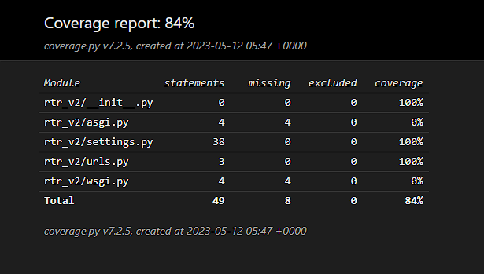
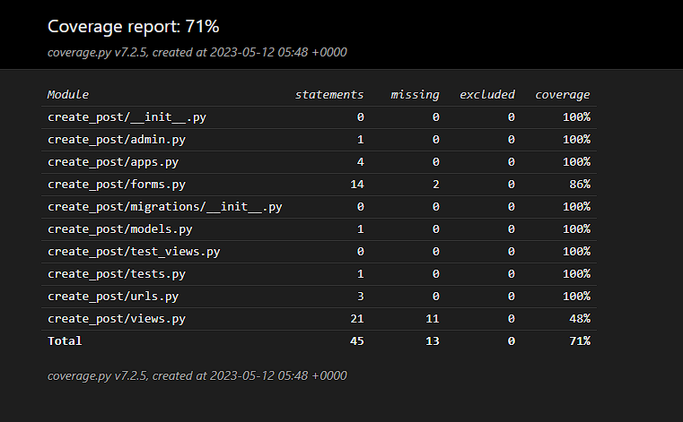
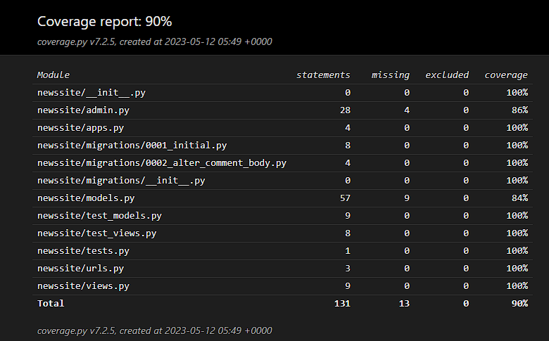
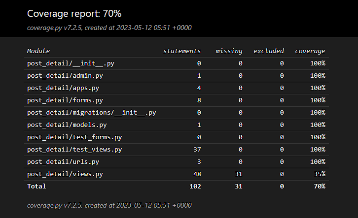
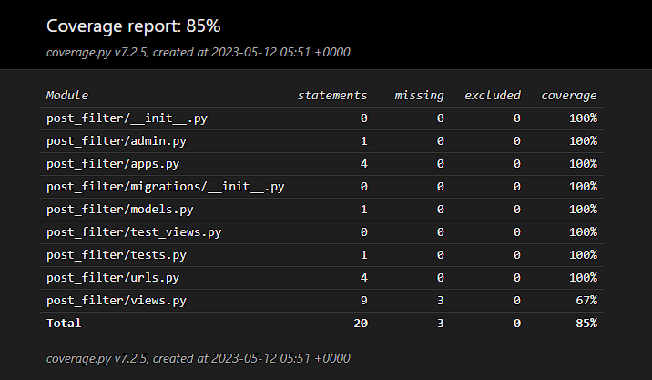

# RTR

## Table of Contents

***

## Project Description

Welcome to RTR (Read, Think, React OR Rater, whatever one prefers really).  
This is supposed to be a newssite that reminds the user A BIT of reddit.  
See the project inception section for the initial thought process that lead up to the "finished" product.  
***

### Project Inception and Purpose

I started planning based on the idea of a "Reddit-style newssite", but i wanted something less "subjective" in terms of what is posted.  
I do not use Reddit all that much, but i do use it enough to know there are things i like and dont like about it, so i started from there.  
Also, it should be a bit more focused on concrete objectiveness and reasoning, "back it up with facts" was in the back of my mind the whole time.  
Some of this is more philosophical than technical, but i tried to make the functionality of the site reflect that mindset.

#### Pros and Cons of Reddit

* Pros:
  * Loads of Topics
  * Finding content you like is quick.
  * Posting Content and responding to it is easy.
  * Sign-up is quick and easy, as most pages are these days.
  * I like the comment section (structurally, the actual discourse is another matter).
  * Ability to follow threads that are relevant to users interests

* Cons:
  * The Karma and Downvote system seems very vulnerable to arbitrary whim, which was something i wanted to avoid.
  * Even in "factual threads", there is a lot of "trashposting", i wanted to separate this from other content.

***

### Planning

#### Initial Identified Needs

* With the pros and cons of reddit in mind, i identified the following basic needs for a user and basic solves for this:
  * Ability for any user to read posted content
  * Ability for any user to quicly navigate content relevant to them (Categories)
  * Signup and login functionality, needed to access expanded functionality
  * Ability for members to make thoughtfully crafted posts
  * Ability for members to like posts they find interesting/they agree with etc.
  * Ability to comment on posts made by members, a feedback system of thought
  * Ability to reply to comments
  * Ability for admins to moderate what posts and comments according to any would-be rules

***

## Models

***

## Technologies used

* Languages
  * HTML
  * JavaScript
  * Css
  * Python

* Frameworks
  * Django

***

## Design

***

## Testing

### PEP-8
Ran all view, model, form and url files through the <a href="https://pep8ci.herokuapp.com/">CI Python Linter</a>, no issues detected

### Coverage test
#### Project Test

  

#### create_post App Test

  

#### newssite App Test

  

#### post_detail App Test

  

#### post_filter App Test

  

* More testing needs to be done

***

## Deployment

### Step-by-step deployment of live site on Heroku

This will detail the general deployment steps without taking non-essential applications into account

* For this deployment, you will need an account on the following pages:
  * <a href="https://id.heroku.com/login">Heroku</a>
  * <a href="https://www.elephantsql.com/">ElephantSQL</a>
  * <a href="https://cloudinary.com/">Cloudinary</a>

1. run command: pip3 install django, see <a href="https://docs.djangoproject.com/en/4.2/topics/install/">django documentation</a> for info on setting up project and apps.
2. Add installed apps to project settings
3. run command: pip3 install gunicorn
4. run command: pip3 install dj_database_url psycopg2
5. run command: pip3 install dj3-cloudinary-storage
6. run command: python3 manage.py migrate
7. run command: pip3 freeze --local > requirements.txt (run this whenever installing new applications to be used in your project).
8. Log into ElephantSQL, click "new instance", select preferred plan (tiny turtle is free) and give your instance a name.
9. Select the a nearby data-center.
10. Review your selected options and click  'Create instance'.
11. Return to ElephantSQL dashboard, click the database instance name and copy the database URL
12. Go to the Heroku dashboard and create a new app, give the app a name and choose the region that suits you best (Europe for me).
13. Open the SETTINGS tab for your app in Heroku
14. Click Reveal Config Vars
15. Add a Config Var and name it DATABASE_URL, paste the url you copied from ElephantSQL at step 11
16. Add another Config Var and name it SECRET_KEY, you can use <a href="https://djecrety.ir/">Djecretly</a> to generate a new random one.
17. In settings.py, under the line: <strong>from pathlib import Path</strong>, type the following:  
  import os  
  import dj_database_url  
  if os.path.isfile("env.py"):  
    import env  
18. Comment out the DATABASE settings used in settings.py and replace with:  
  DATABASES = {  
   'default':  
  dj_database_url.parse(os.environ.get("DATABASE_  
  URL"))  
  }  
  (Keep the old one in case you need the local environment sqllite settings in the future)  
19. run command: python3 manage.py makemigrations
20. run command: python3 manage.py migrate
21. Go to you Cloudinary dashboard and copy your Cloudinary URL / API Environment Variable.
22. Add another Config Var in you Heroku app named: CLOUDINARY_URL
23. add your cloudinary url to the var, remove any text before 'cloudinary://' in the url
24. In settings.py, in the INSTALLED APPS list, add the following:  
  'cloudinary_storage',  
  'django.contrib.staticfiles',  
  'cloudinary',  
  (order is important here)  
25. In settings.py, under the line: STATIC_URL = '/static/' add the following:  
  STATICFILES_STORAGE = 'cloudinary_storage.storage.StaticHashedCloudinaryStorage'  
  STATICFILES_DIRS = [os.path.join(BASE_DIR, 'static')]  
  STATIC_ROOT = os.path.join(BASE_DIR, 'staticfiles')  
  MEDIA_URL = '/media/'  
  DEFAULT_FILE_STORAGE = 'cloudinary_storage.storage.MediaCloudinaryStorage'  
26. In settings.py, under the BASE_DIR line, add the following:  
  TEMPLATES_DIR = os.path.join(BASE_DIR, 'templates')  
27. In settings.py, find the TEMPLATES list, and add TEMPLATES_DIR to the 'DIRS' list inside
28. In settings, add the Heroku hostname to ALLOWED_HOSTS like this:  
  ALLOWED_HOSTS = ["PROJ_NAME.herokuapp.com", "localhost"]
29. At the top level directory, create these 3 folders: media, static, templates
30. At the top level directory, create a file named Procfile
31. in the Procfile, add the following: web: gunicorn PROJ_NAME.wsgi (replace PROJ_NAME with your project name)
32. Add, Commit and Push the changes to github
33. In Heroku, navigate to your apps 'Deploy' tab and:  
  Select github as deployment  
  At 'App connected to GitHub', Search and find your apps repo, then connect it.
  Scroll down and click 'Deploy Branch' (Main should be selected by default)
34. Wait while the app is building, then click 'View' to make sure it worked
35. Job done

***

## Bugs

***

## Future Implementation

### Comment Reply System

* As of now, limited to the posts author being the only one able to make a reply

### Notification system

* This is needed for the Comment Reply System to be practical.

### NewsCatcher News-API

* This was originally implemented many months ago, sadly only had 50 free requests and the subscription-price is steep.  
  Contacted NewsCatcher about adding more requests to my api-key, did not get an answer back.  
  Thought about keeping the code for reference,  
  but it's technically broken so finally decided on removing it altogether.  
  Will keep looking for a replacement.
